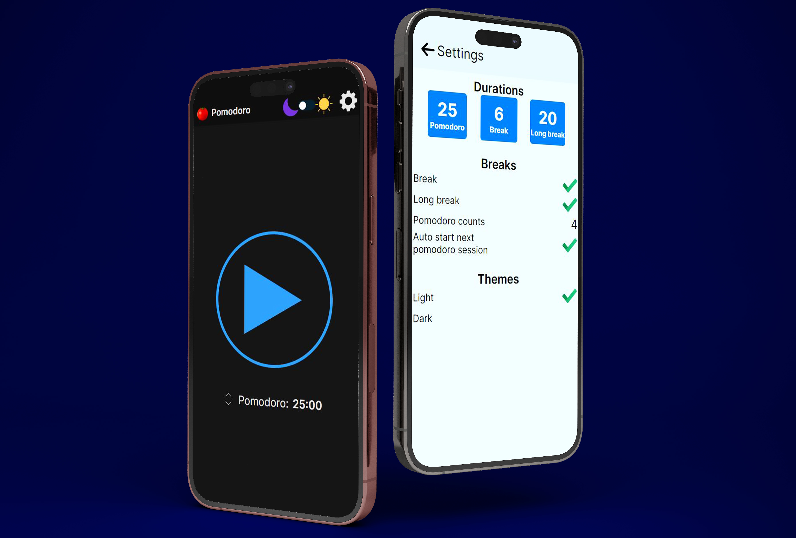
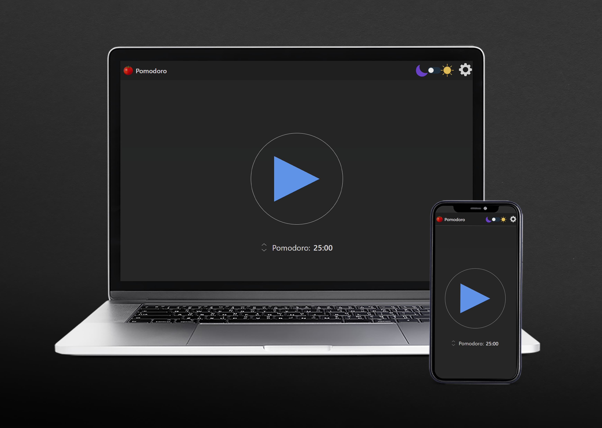
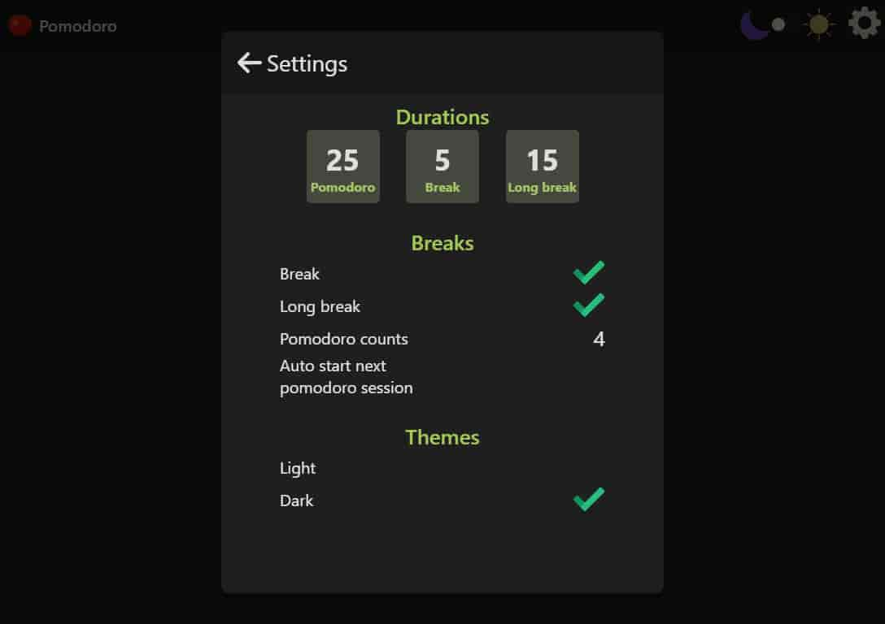
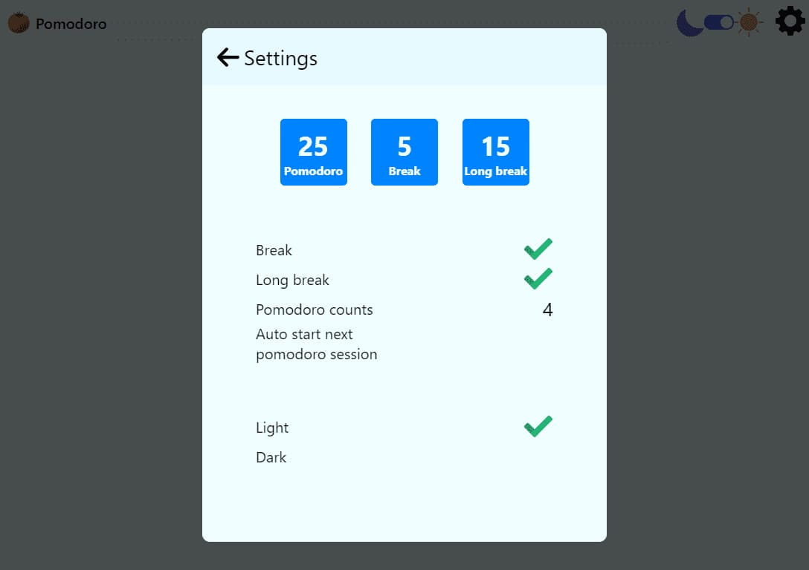

# Pomodoro timer

Pomodoro Apps - Web app, chrome extension, React Native App

## Web Application

- React
- Redux Toolkit
- TypeScript
- Webpack

## Chrome extension

- HTML/SCSS
- TypeScript/JavaScript
- Webpack
- Chrome Storage

## Mobile

- React Native
- Redux Toolkit
- TypeScript

## Figma

https://www.figma.com/file/KlVsemPIeBHVVdnhfKybUr/Pomodoro-app

## Web

https://pomodoro11.vercel.app/

## Chrome Web Store

https://chrome.google.com/webstore/detail/pomodoro-timer/ecfahmjaaikpolggmimbeobegomfgpeb

## Google Play

https://play.google.com/store/apps/details?id=com.aliaksei.hryhoryeu.PomodoroTimer&pli=1

