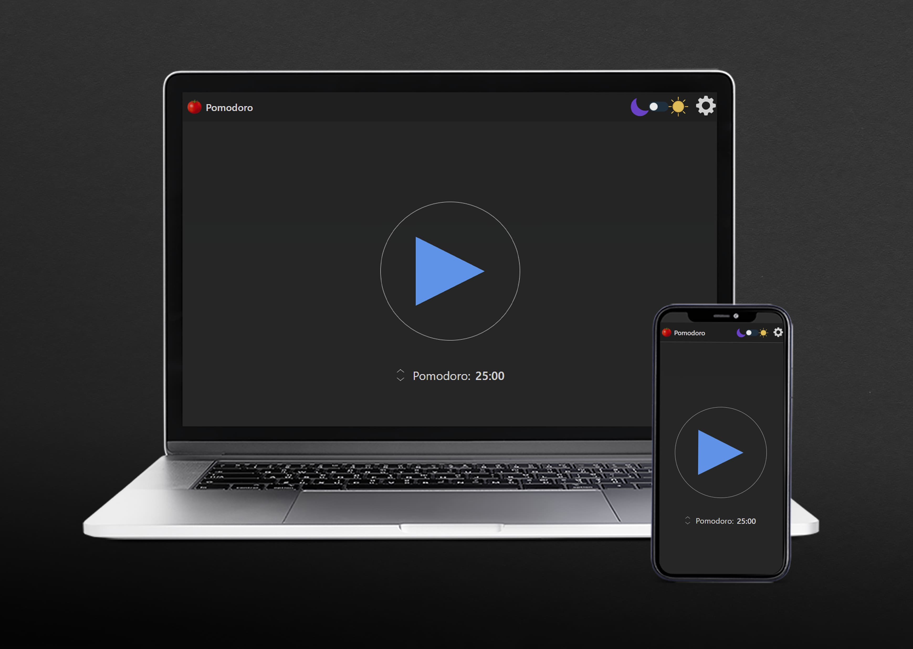
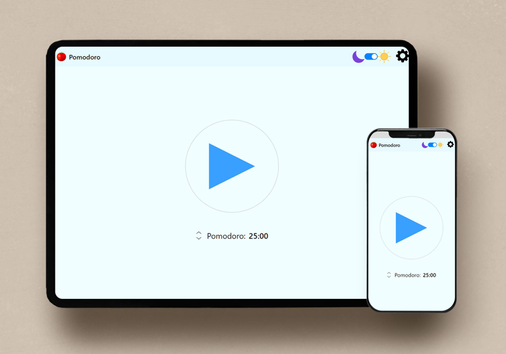
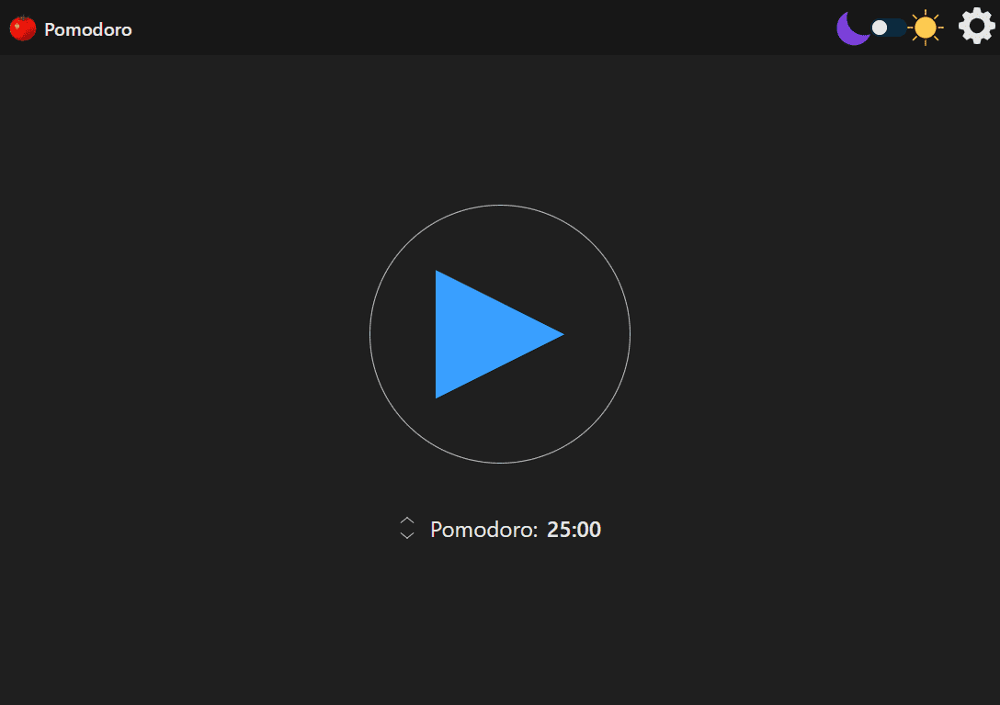
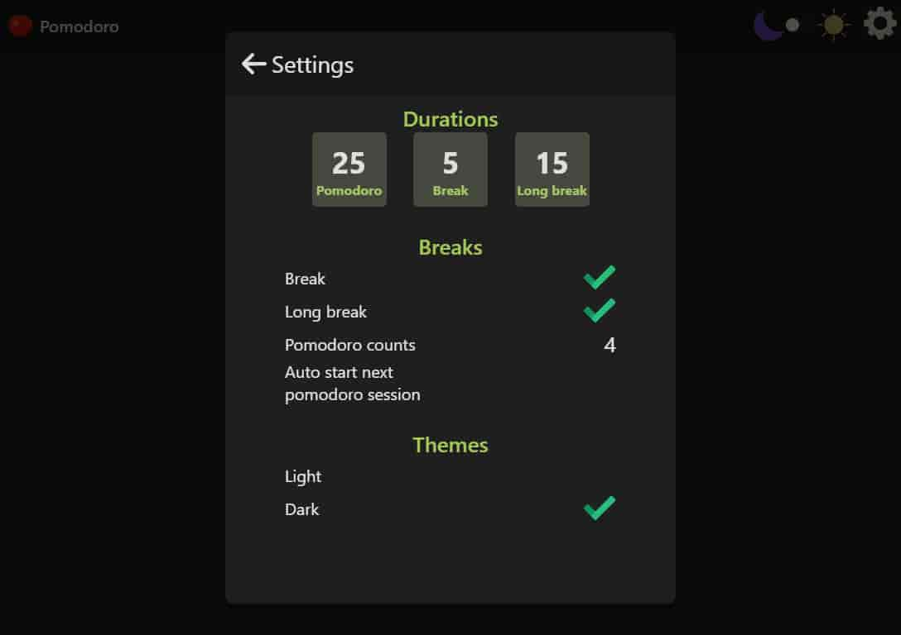
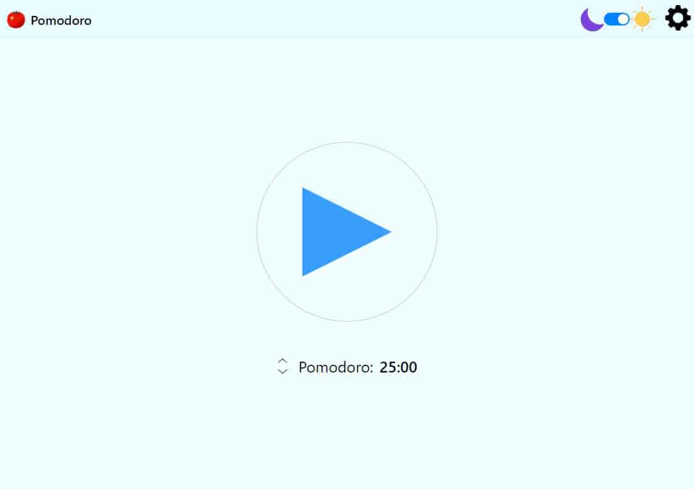
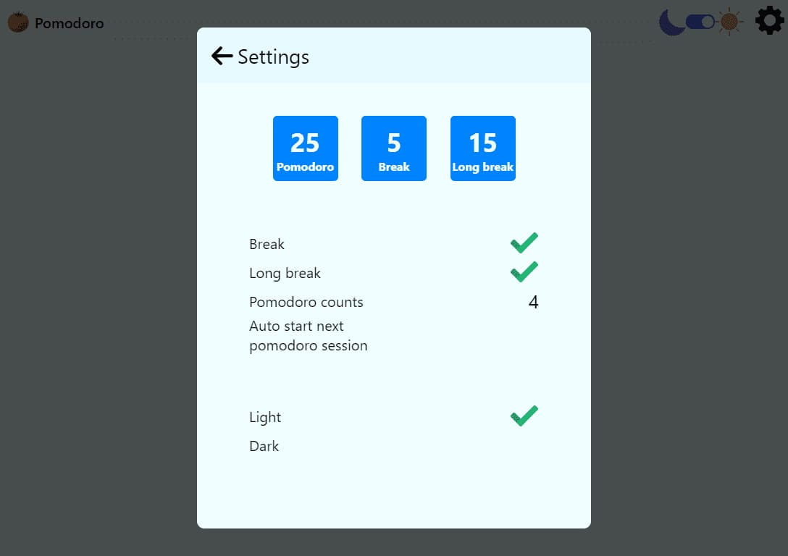

# Pomodoro timer

## Short Description

Pomodoro app, data can save in local storage,

## Web Application

- React
- Redux, Redux Toolkit
- TypeScript
- Webpack

## Mobile will be

- React Native
- Redux, Redux Toolkit
- TypeScript
- Expo

## Chrome extension - maybe later

- HTML
- CSS
- JavaScript

## Figma

https://www.figma.com/file/KlVsemPIeBHVVdnhfKybUr/Pomodoro-app

## Google play

.....

## Web

https://pomodoro11.vercel.app/

